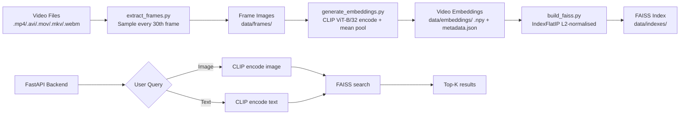
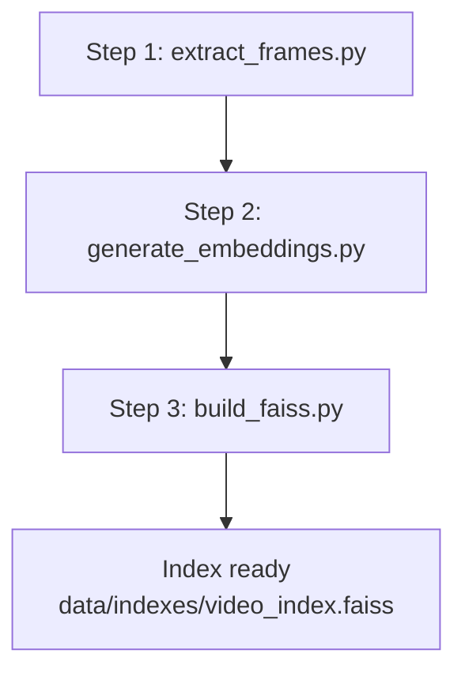
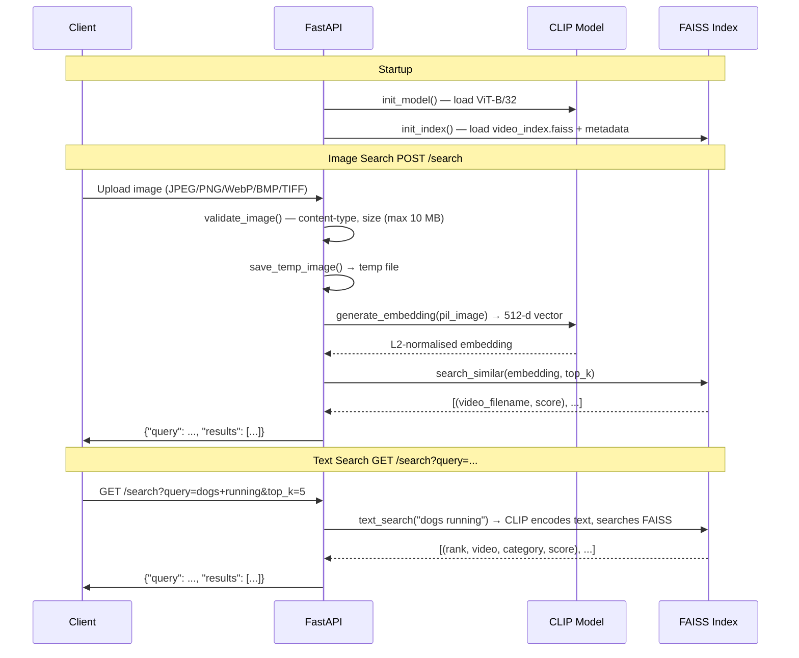

# Video Retrieval System

Content-based video retrieval using **OpenAI CLIP** (ViT-B/32) and **FAISS** for semantic similarity search. Supports both **image-to-video** and **text-to-video** search via a FastAPI backend.

---

## Overview

This system ingests a collection of videos, samples frames at regular intervals, encodes each frame with CLIP, and mean-pools the per-frame embeddings into a single 512-dimensional video vector. All video vectors are indexed with FAISS for fast nearest-neighbour search. A FastAPI server serves two query modes:

- **Image query** — upload a picture (JPEG/PNG/WebP/BMP/TIFF) and retrieve the most visually similar videos.
- **Text query** — provide a natural-language description (e.g. *"a dog running on grass"*) and retrieve semantically matching videos.

---

## Features

| Feature | Description |
|---|---|
| Semantic search | CLIP joint vision-language embedding enables cross-modal retrieval |
| Image-to-video | Query by example — upload any image |
| Text-to-video | Query by natural-language description |
| Cosine similarity | All vectors L2-normalised; FAISS IndexFlatIP returns cosine similarity |
| Fast inference | CLIP model + FAISS index loaded once at server startup (singleton) |
| Automatic device selection | Prefers CUDA → MPS (Apple Silicon) → CPU |
| Configurable pipeline | Frame interval, batch size, top-K all set in `config.py` |
| Audit suite | `_audit.py` validates normalisation, retrieval quality, latency, and scalability |

---

## System Architecture



The system is split into two independent parts:

1. **ML Pipeline** (offline) — process videos, generate embeddings, build the FAISS index.
2. **Backend** (online) — FastAPI server that loads the pre-built index and serves queries.

---

## Project Structure

```
retrieval_video_system/
├── backend/
│   ├── __init__.py
│   ├── main.py           # FastAPI app, lifespan events, endpoints
│   ├── model.py          # CLIP model loader + generate_embedding()
│   ├── search.py         # FAISS index loader, image & text search
│   └── utils.py          # File validation, temp storage, cleanup
├── ml_pipeline/
│   ├── config.py         # Paths, hyperparameters, device selection
│   ├── utils.py          # Shared filesystem & logging helpers
│   ├── extract_frames.py # Step 1: sample frames from videos
│   ├── generate_embeddings.py  # Step 2: CLIP encoding
│   ├── build_faiss.py    # Step 3: IndexFlatIP construction
│   ├── search_index.py   # Text-to-video search (CLI + reusable API)
│   └── _audit.py         # Quality / performance audit
├── data/
│   ├── videos/           # Place source videos here (empty in repo)
│   └── embeddings/       # Output location for .npy and metadata
├── requirements.txt
├── .gitignore
└── README.md
```

---

## Technology Stack

| Component | Technology |
|---|---|
| Embedding model | [OpenAI CLIP ViT-B/32](https://github.com/openai/CLIP) |
| Embedding dimension | 512 |
| Similarity index | FAISS `IndexFlatIP` (brute-force inner product) |
| Similarity metric | Cosine similarity (via L2 normalisation + IP) |
| Backend framework | FastAPI (Python 3.10+) |
| Server | Uvicorn |
| Image processing | Pillow |
| Video decoding | OpenCV (`cv2`) |

### Key Dependencies

- `torch` & `torchvision` — model inference
- `faiss-cpu` — vector similarity search
- `clip` — GitHub: `openai/CLIP`
- `fastapi` & `uvicorn` — REST API
- `python-multipart` — file upload support
- `opencv-python` — frame extraction
- `numpy` & `Pillow` — array & image processing
- `ftfy` & `regex` — CLIP text preprocessing

---

## ML Pipeline Workflow

The pipeline runs **offline** and must complete before the backend can serve queries.



### Step 1 — Frame Extraction

```
python ml_pipeline/extract_frames.py
```

- Reads all videos from `ml_pipeline/data/videos/` (supports `.mp4`, `.avi`, `.mov`, `.mkv`, `.webm`).
- Saves every **30th frame** (configurable via `FRAME_INTERVAL`) as JPEG.
- Output preserves the subdirectory structure:

```
data/frames/
  └── <category>/
      └── <video_name>/
          ├── frame_00000.jpg
          ├── frame_00001.jpg
          └── ...
```

### Step 2 — Generate Embeddings

```
python ml_pipeline/generate_embeddings.py
```

- Walks `data/frames/` and groups frames by video.
- Loads CLIP ViT-B/32.
- Encodes all frames of a video in batches (`BATCH_SIZE=32`) and L2-normalises each frame embedding.
- **Mean-pools** all frame embeddings into a single 512-d video vector, then re-normalises.
- Saves:
  - `data/embeddings/video_embeddings.npy` — shape `(N, 512)` float32 array
  - `data/embeddings/video_metadata.json` — list of `N` video path strings

### Step 3 — Build FAISS Index

```
python ml_pipeline/build_faiss.py
```

- Loads the `.npy` embeddings and L2-normalises every row.
- Builds a FAISS `IndexFlatIP` (brute-force inner product).
- Adds all vectors to the index.
- Saves:
  - `data/indexes/video_index.faiss`
  - `data/indexes/video_metadata.json`
- Runs a self-query sanity check (vector 0 should retrieve itself with score ≈ 1.0).

### Audit Script

```
python ml_pipeline/_audit.py
```

A standalone diagnostic script that validates:

- Embedding L2 normalisation (all within 1.0 ± 0.001)
- FAISS index count and type
- Self-retrieval accuracy (≥ 99.9%)
- Cross-category separation (intra‑category similarity > inter‑category)
- Text-to-video accuracy (top-1 / top-5)
- Score distribution and duplicate detection
- Search latency and projected latency at scale (1K – 1M vectors)
- Memory footprint estimates
- Device detection (CUDA / MPS / CPU)
- Index type recommendation based on vector count

---

## Backend Workflow



---

## Installation

### Prerequisites

- Python 3.10 or later
- pip

### Setup

```bash
# 1. Clone the repository
git clone <repo-url>
cd retrieval_video_system

# 2. Create a virtual environment
python -m venv venv
source venv/bin/activate   # macOS / Linux
# venv\Scripts\activate    # Windows

# 3. Install dependencies
pip install -r requirements.txt
```

> **Note on CLIP**: The `requirements.txt` pins CLIP from `git+https://github.com/openai/CLIP.git`. Ensure you have git installed and an internet connection for the first install. If you encounter issues with `faiss-cpu`, install it separately via `pip install faiss-cpu`.

---

## Usage

### 1. Prepare Videos

Place your video files (`.mp4`, `.avi`, `.mov`, `.mkv`, `.webm`) in:

```
ml_pipeline/data/videos/
```

You can organise them into category subfolders:

```
ml_pipeline/data/videos/
  ├── animals/
  │   ├── lion.mp4
  │   └── tiger.mp4
  ├── vehicles/
  │   └── car.mp4
  └── ...
```

### 2. Run the Full Pipeline

```bash
# Option A: Run each step manually
python ml_pipeline/extract_frames.py
python ml_pipeline/generate_embeddings.py
python ml_pipeline/build_faiss.py
```

### 3. (Optional) Run the Audit

```bash
python ml_pipeline/_audit.py
```

### 4. Start the Backend Server

```bash
uvicorn backend.main:app --reload --host 0.0.0.0 --port 8000
```

The server will:
- Load CLIP ViT-B/32 on the best available device.
- Load the FAISS index from `ml_pipeline/data/indexes/video_index.faiss`.
- Print confirmation to the console.

---

## API Endpoints

### `GET /health`

Liveness probe. Returns `{"status": "ok"}` if the server is running.

### `GET /`

Root endpoint. Returns `{"message": "Video Retrieval System Running"}`.

### `GET /search` — Text-to-Video Search

Search for videos matching a natural-language description.

**Query Parameters**:

| Parameter | Type | Default | Description |
|---|---|---|---|
| `query` | `str` | (required) | Natural-language search query (min 1 char) |
| `top_k` | `int` | `5` | Number of results (1–50) |

**Example Request**:

```bash
curl "http://localhost:8000/search?query=a+dog+running+on+grass&top_k=3"
```

**Example Response**:

```json
{
  "query": "a dog running on grass",
  "results": [
    {"rank": 1, "video": "animals/dog_running.mp4", "category": "animals", "score": 0.8123},
    {"rank": 2, "video": "animals/puppy_play.mp4", "category": "animals", "score": 0.7641},
    {"rank": 3, "video": "nature/park_scene.mp4", "category": "nature", "score": 0.6987}
  ]
}
```

### `POST /search` — Image-to-Video Search

Upload an image and retrieve the most visually similar videos.

**Request** (multipart/form-data):

| Field | Type | Description |
|---|---|---|
| `image` | file | Image file (JPEG, PNG, WebP, BMP, or TIFF; max 10 MB) |
| `top_k` | int (query) | Number of results (1–50, default 5) |

**Example Request**:

```bash
curl -X POST "http://localhost:8000/search?top_k=3" \
  -F "image=@query_image.jpg"
```

**Example Response**:

```json
{
  "query": "query_image.jpg",
  "results": [
    {"video": "vehicles/car_on_road.mp4", "score": 0.8912},
    {"video": "vehicles/truck_hwy.mp4", "score": 0.7543},
    {"video": "animals/deer_field.mp4", "score": 0.6211}
  ]
}
```

---

## Search Modes

| Mode | Endpoint | Query Encoding | Use Case |
|---|---|---|---|
| Image search | `POST /search` | CLIP `encode_image` | "Find videos that look like this picture" |
| Text search | `GET /search` | CLIP `encode_text` | "Find videos matching a description" |

Both modes produce L2-normalised embeddings and search the same FAISS `IndexFlatIP`. The returned `score` is cosine similarity in `[-1, 1]` (higher = more similar).

---

## Configuration

All tunable parameters are in **`ml_pipeline/config.py`**:

| Parameter | Default | Description |
|---|---|---|
| `FRAME_INTERVAL` | `30` | Extract every Nth frame |
| `CLIP_MODEL_NAME` | `"ViT-B/32"` | CLIP model variant |
| `CLIP_EMBEDDING_DIM` | `512` | Embedding vector dimensionality |
| `BATCH_SIZE` | `32` | Frames per CLIP forward pass |
| `DEFAULT_TOP_K` | `5` | Default number of search results |
| `DEVICE` | auto | `cuda` > `mps` > `cpu` |

Paths are built relative to `ml_pipeline/`:
- `DATA_DIR/data/videos/` — source video input
- `DATA_DIR/data/frames/` — extracted frame images
- `DATA_DIR/data/embeddings/` — `.npy` + `video_metadata.json`
- `DATA_DIR/data/indexes/` — FAISS index + metadata copy

---

## Dataset Structure

```
ml_pipeline/data/
├── videos/              # INPUT — place your videos here
│   ├── category_a/
│   │   ├── video_1.mp4
│   │   └── video_2.mp4
│   └── category_b/
│       └── video_3.mp4
├── frames/              # AUTO-GENERATED by extract_frames.py
│   ├── category_a/
│   │   ├── video_1/
│   │   │   ├── frame_00000.jpg
│   │   │   └── ...
│   │   └── video_2/
│   └── category_b/
│       └── video_3/
├── embeddings/          # AUTO-GENERATED by generate_embeddings.py
│   ├── video_embeddings.npy
│   └── video_metadata.json
└── indexes/             # AUTO-GENERATED by build_faiss.py
    ├── video_index.faiss
    └── video_metadata.json
```

The **metadata JSON** is a flat list of video path strings:

```json
[
  "animals/lion",
  "animals/tiger",
  "vehicles/car"
]
```

Position `N` in the list corresponds to row `N` in the FAISS index.

---

## Text-to-Video Search (CLI)

The pipeline includes an interactive CLI for text search without starting the server:

```bash
# One-shot query
python ml_pipeline/search_index.py "people walking on beach"

# Interactive mode
python ml_pipeline/search_index.py
```

---

## Troubleshooting

| Problem | Likely Cause | Solution |
|---|---|---|
| `FileNotFoundError: FAISS index not found` | Pipeline not run yet | Run `build_faiss.py` first |
| `RuntimeError: FAISS index not initialized` | Index path mismatch | Check `DEFAULT_INDEX_PATH` in `backend/search.py` |
| `HTTPException: Unsupported file type` | Wrong image format | Use JPEG, PNG, WebP, BMP, or TIFF |
| `HTTPException: File too large` | Image > 10 MB | Resize or compress the image |
| Slow CLIP encoding on CPU | No GPU available | Use a machine with CUDA or Apple Silicon (MPS) |
| `ValueError: video_metadata.json must be a list` | Corrupted metadata | Re-run `generate_embeddings.py` |

---

## Future Improvements

- **Quantised index** — replace `IndexFlatIP` with `IVF` or `HNSW` for sub‑50 ms search at scale (>100K videos)
- **Pre-computed text embeddings** — cache frequent text queries
- **Frame‑level search** — return matching frame timestamps instead of whole videos
- **Docker deployment** — containerised `Dockerfile` + `docker-compose.yml`
- **Streaming video input** — process videos incrementally via a watch directory
- **Web UI** — simple frontend for drag-and-drop image / text search
- **Unit & integration tests** — `pytest` suite for backend endpoints
- **CI/CD** — GitHub Actions for lint, type-check, and pipeline regression
